# End-to-End Data Engineering Pipeline for Movie Data

[](https://github.com/QuentinElGuay/portfolio-movies-etl/releases)

> [!IMPORTANT]
> 🚧 This project is under **<ins>active development</ins>.**
>
> New features are implemented
> incrementally while maintaining a working end-to-end pipeline. Some components are intentionally
> incomplete or subject to refactoring as the architecture evolves.
>
> Current development is targeting **[v0.5.0](#roadmap)**, focused on the Gold Layer & Data Visualization.
> Future milestones include a Gold layer, BI dashboard, Airflow orchestration, cloud deployment, CI/CD and
> automated testing. See the [Roadmap](#roadmap) section for planned improvements.

## Table of Contents

- [Overview](#overview)
- [Goal](#goal)
- [Dataset](#dataset)
- [Architecture](#architecture)
- [Tech Stack](#tech-stack)
- [Project Structure](#project-structure)
- [Getting Started](#getting-started)
  - [Prerequisites](#prerequisites)
  - [Run the project locally](#run-the-project-locally)
  - [Clean up Docker resources](#clean-up-docker-resources)
- [Roadmap](#roadmap)
- [Contributing](#contributing)
- [License](#license)

## Overview

This project demonstrates a production-inspired end-to-end ELT pipeline that tackles a common data 
engineering challenge: transforming operational API data into trusted, analytics-ready datasets.
The pipeline is designed around a realistic data engineering use case and showcases modern engineering
practices, including clean architecture, reproducibility, orchestration, automated testing, CI/CD,
infrastructure as code, data quality, observability, and maintainability. As a portfolio project,
the emphasis is on software and data engineering practices rather than processing data at massive scale.

It was inspired by a technical take-home assignment from a hiring process and later evolved into the final
project for the [Data Engineering Zoomcamp](https://github.com/DataTalksClub/data-engineering-zoomcamp) by
[DataTalks.Club](https://datatalks.club).

## Problem statement

Movie metadata and user ratings are often exposed through REST APIs that are optimized for operational
access rather than analytical workloads. The pipeline ingests this data, validates it, organizes it into
a lakehouse architecture, and transforms it into analytics-ready datasets for reporting and business 
intelligence.

## Dataset

For this project, I decided to use the `movies_metadata.csv` and `ratings_small.csv` files from the
[Movies Dataset from Rounak Banik](https://www.kaggle.com/datasets/rounakbanik/the-movies-dataset/)
available on Kaggle. Rather than having the pipeline read the CSV files directly, I decided to
expose the data through a custom Flask REST API with multiple paginated collection endpoints. This
approach better simulates a real-world data engineering scenario in which data is ingested from an
external service.

## Architecture

The pipeline follows the Medallion architecture and lakehouse design principles. Data is
progressively refined through successive storage layers, increasing in quality and structure before
being exposed for analytical consumption.

1. **Bronze** – Ingest data from a REST API and store it as NDJSON.
2. **Silver** – Validate, clean, and standardize the raw data into Parquet datasets.
3. **Gold** – Load the curated data into a dimensional (star schema) data model to support
   analytical workloads.
4. **Consumption** – Expose business metrics through a Business Intelligence dashboard.

```mermaid
flowchart LR
    subgraph "Source (Kaggle)"
        KAGGLE[Movies Dataset]
    end

    subgraph Rest API
        direction TB
        DUCKDB[(DuckDB)]
        API[Flask]
    end

    subgraph Pipeline
        direction LR

        subgraph Ingestion
            direction TB
            EXTRACT["Extract"]
            BRONZE@{shape: datastore, label: "Raw /
            Bronze layer"}
            NDJSON@{ shape: docs, label: "NDJSON" }
        end

        subgraph Standardization
            direction TB
            CLEAN["Clean & Standardize"]
            SILVER@{shape: datastore, label: "Refined /
            Silver layer"}
            PARQUET@{ shape: docs, label: "Parquet" }
        end

        subgraph Serving
            direction TB
            LOAD["Load"]
            GOLD@{shape: datastore, label: "Data Marts /
            Gold layer"}
            DW[(Data
            Warehouse)]
        end
    end

    subgraph BI
        DASHBOARD[Dashboard]
    end

    KAGGLE -.-> DUCKDB
    DUCKDB --> API
    API --> EXTRACT
    EXTRACT --> BRONZE
    BRONZE --> NDJSON
    NDJSON --> CLEAN
    CLEAN --> SILVER
    SILVER --> PARQUET
    PARQUET --> LOAD
    LOAD --> GOLD
    GOLD --> DW
    DW -.-> DASHBOARD
```



## Tech Stack

| Category         | Technology             | Role                                       |
| ---------------- | ---------------------- | ------------------------------------------ |
| Data Source      | Kaggle                 | Original movie dataset                     |
| REST API         | Flask, DuckDB          | Simulate an external 3rd party API         |
| Ingestion        | Python, Requests       | Extract data from the REST API             |
| Data Lake        | NDJSON, Parquet        | Bronze and Silver storage layers           |
| Cleaning         | Python, Pandas         | Clean, standardize, and prepare data       |
| Data Warehouse   | PostgreSQL, SQLAlchemy | Load and store the dimensional model       |
| Containerization | Docker Compose         | Reproducible local development environment |

## Project Structure

```text
.
├── api/                Flask REST API exposing the movie dataset
├── pipeline/           ELT pipeline implementation
├── docs/               Project documentation (future)
├── .github/            GitHub Actions workflows (future)
├── docker-compose.yml  Local development environment
└── README.md
```

The project is organized into independent components to reflect a production-oriented architecture.
Each module has a single responsibility and independent environment.

## Getting Started

### Prerequisites

- Docker
- Docker Compose

### Run the project locally

Create the `.env` file from the `.env.template` (no change required to run locally).

```bash
cp .env.template .env
```

Build the local images

```bash
docker compose build
```

Run the API and database service in the background

```bash
docker compose up prepare-data api postgres -d
```

Run the ETL pipeline

```bash
docker compose run --rm pipeline
```

### Clean up Docker resources

To remove all containers, networks, volumes, and locally built images created by this project:

```bash
docker compose down --volumes --rmi local
```

## Roadmap

This project follows an iterative, real-world development approach, where each release introduces a coherent set of features while continuously improving the overall architecture.

The roadmap is designed to satisfy the requirements of the **Data Engineering Zoomcamp** final project, as described in the [Overview](#overview), while showcasing how a simple data pipeline can progressively evolve into a production-ready data platform.

The first versions intentionally rely on a custom Python implementation to better understand and demonstrate the fundamentals of data engineering. As the project matures, additional technologies will be introduced to reflect common industry practices, including workflow orchestration, cloud storage, infrastructure as code, and analytical tooling. Future iterations may also explore technologies such as Apache Spark, dbt, streaming pipelines or cloud-native data warehouses like BigQuery.

The roadmap below reflects the planned evolution of the project through incremental milestones:

* **v0.1.0: MVP Pipeline**

  * ✅ REST API ingestion
  * ✅ Batch ingestion
  * ✅ PostgreSQL loading
  * ✅ Docker Compose

* **v0.2.0: ELT Architecture & Dimensional Modeling**

  * ✅ ELT pipeline
  * ✅ Basic dimensional modeling (star schema)

* **v0.3.0: Lake Ingestion & Data Validation**

  * ✅ Bronze data lake
  * ✅ API schema validation (Pydantic)

* **v0.4.0: Bronze Layer Reliability & Metadata Management**

  * ✅ Manifest files
  * ✅ Immutable Bronze snapshots

* **v0.5.0: Silver Layer & Data Refinement** *(work in progress)*

  * 🚧 Generic extraction framework
  * 🚧 Dataset standardization

* v0.6.0: Gold Layer & Data Visualization

  * ⏳ PostgreSQL analytical views
  * ⏳ Metabase dashboard

* v0.7.0: Cloud Storage Integration

  * ⏳ S3-compatible object storage
  * ⏳ MinIO local environment

* v0.8.0: Pipeline Execution & Orchestration

  * ⏳ Pipeline CLI
  * ⏳ Airflow orchestration

* v0.9.0: Testing, Quality & Tooling

  * ⏳ Automated testing
  * ⏳ Pre-commit hooks
  * ⏳ CI checks
  * ⏳ Code formatting and linting
  * ⏳ Makefile
  * ⏳ Project documentation

* v0.10.0: Infrastructure as Code

  * ⏳ Terraform infrastructure
  * ⏳ Environment provisioning

* v1.0.0: Production-Ready Data Platform

  * ⏳ Cloud deployment
  * ⏳ Automated pipeline execution
  * ⏳ CI/CD
  * ⏳ Monitoring and observability

## Contributing

This repository is maintained as a personal portfolio and learning project. While external
contributions are not currently accepted, feedback, bug reports, and suggestions are always welcome
through GitHub Issues.

## License

This repository is publicly available for educational, portfolio, and evaluation purposes.

The source code is **not open source**. All rights are reserved by the author. No permission is
granted to copy, modify, redistribute, or use this software without prior written permission.
