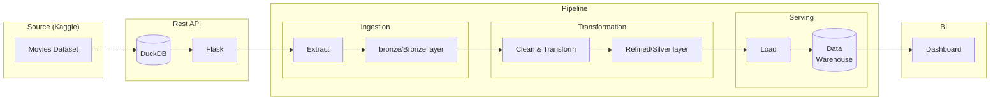

# End to End Movies ETL Data Engineering Pipeline
[](https://github.com/QuentinElGuay/portfolio-movies-etl/releases)

> [!IMPORTANT]
> 🚧 This project is actively developed. New features are implemented incrementally while maintaining a working end-to-end pipeline. See the Roadmap section for planned improvements.

## Overview

This project demonstrates a production-inspired batch data engineering pipeline. It was inspired by
a technical take-home assignment from a hiring process and later evolved into the final project for
the [Data Engineering Zoomcamp](https://github.com/DataTalksClub/data-engineering-zoomcamp) by
[DataTalks.Club](https://datatalks.club).

As a portfolio project, this repository focuses on demonstrating production-ready software and data
engineering practices - including clean architecture, reproducibility, orchestration, automated
testing, CI/CD, infrastructure as code, data quality, observability and maintainability - rather
than processing very large datasets.

### Dataset

For this project, I decided to use the `movies_metadata.csv` and `ratings_small.csv` files from the
[Movies Dataset from Rounak Banik](https://www.kaggle.com/datasets/rounakbanik/the-movies-dataset/)
available on Kaggle. Rather than having the pipeline read the CSV files directly, I decided to
expose the data through a custom Flask REST API with multiple paginated collection endpoints. This
approach better simulates a real-world data engineering scenario in which data is ingested from an
external service.

### Goal

The goal of this pipeline is to ingest data from a REST API into a data lake, clean it and transform
it into analytics-ready datasets before loading it into a data warehouse, and ultimately use it to
power a BI dashboard.

### Architecture



### Progress

- ✅ REST API
- ✅ Batch ingestion
- ✅ Raw data lake (Bronze)
- 🚧 ELT pipeline
- 🚧 Dimensional modeling (Star Schema)
- ⏳ Gold layer
- ⏳ BI dashboard
- ⏳ Airflow orchestration
- ⏳ Cloud Deployment
- ⏳ Infrastructure as Code
- ⏳ Automated testing
- ⏳ CI/CD...

## Getting Started

### Prerequisites

- Docker
- Docker Compose

### Run the project locally

Create the `.env` file from the `.env.template` (no change required to run locally).
```bash
cp .env.template .env
```

 Build the local images
```bash
docker compose build
```

Run the API and database service in the background
```bash
docker compose up prepare-data api postgres -d
```

Run the ETL pipeline
```bash
docker compose run --rm etl 
```

### Clean up Docker resources

To remove all containers, networks, volumes, and locally built images created by this project:

```bash
docker compose down --volumes --rmi local
```

# Work In Progress

> [!NOTE]
> Sections under this note are on progress and shouldn't be considered as reliable or definitive.

### Original project

This project was first created as a technical challenge for a senior data engineer hiring process.
The challenge was as follow:

> You have access to a data source that exposes the following API:
>
> - POST - /auth
> - GET - /api/v1/genres
> - GET - /api/v1/genres/{genreId}/movies
> - GET - /api/v1/movies/{movieId}
> - GET - /api/v1/movies/{movieId}/ratings
>
> Inferring the information each endpoint contains:
>
> 1. Create a Postgres table that will contain the main information from these endpoints;
> 2. Write an ETL in Python that will populate this schema.

For this challenge I decide to implement a simple in-memory Python pipeline that would use:

- `Flask` reading from JSON files to simulate the API
- `requests` to download data from the API
- `Pandas` to manipulate the data and load the result into a `Postgres` database
- `docker compose` to coordinate the services

## Project Structure

```text
.
├── api/
├── etl/
├── docker-compose.yml
├── .env.template
└── README.md
```

## Technology Stack

- Python
- Flask
- PostgreSQL
- SQLAlchemy
- Docker Compose
- uv

## Pipeline Overview

1.  Authenticate with the API.
2.  Download movie data.
3.  Transform the data.
4.  Load it into PostgreSQL.

## Adding New Code

- Add new API endpoints in `api/`.
- Add extraction and transformation logic in `etl/`.
- Add new database tables and loaders as needed.
- Store configuration in `.env`.

## Next Steps

### Code Quality

- Unit tests
- Integration tests
- Better logging
- Improved error handling

### CI/CD

- Automated testing
- Docker image builds
- Deployment pipeline

### Orchestration

- Airflow DAG
- Scheduling
- Retries
- Monitoring

### Cloud

- S3 data lake
- dbt transformations
- Trino or BigQuery

### Performance

- Parallel API requests
- Batch inserts
- Incremental loading

## Acknowledgements

- Dataset source
- API inspiration
- Useful references

## Disclaimer

This project is intended for educational and portfolio purposes. Commercial use is not the intended
goal.
