# End to End Movies ETL Data Engineering Pipeline

[](https://github.com/QuentinElGuay/portfolio-movies-etl/releases)

> [!IMPORTANT]
> 🚧 **This project is under active development.** New features are implemented
> incrementally while maintaining a working end-to-end pipeline. Some components are intentionally
> incomplete or subject to refactoring as the architecture evolves. See the Roadmap section for
> planned improvements.
>
> Current development is targeting **v0.3.0**, focused on API validation with Pydantic. Future
> milestones include a Gold layer, BI dashboard, Airflow orchestration, cloud deployment, CI/CD and
> automated testing.

## Table of Contents

- [Overview](#overview)
- [Goal](#goal)
- [Dataset](#dataset)
- [Architecture](#architecture)
- [Tech Stack](#tech-stack)
- [Project Structure](#project-structure)
- [Getting Started](#getting-started)
  - [Prerequisites](#prerequisites)
  - [Run the project locally](#run-the-project-locally)
  - [Clean up Docker resources](#clean-up-docker-resources)
- [Roadmap](#roadmap)
- [Release History](#release-history)
- [Contributing](#contributing)
- [License](#license)

## Overview

This project demonstrates a production-inspired batch data engineering pipeline. It was inspired by
a technical take-home assignment from a hiring process and later evolved into the final project for
the [Data Engineering Zoomcamp](https://github.com/DataTalksClub/data-engineering-zoomcamp) by
[DataTalks.Club](https://datatalks.club).

As a portfolio project, this repository focuses on demonstrating production-ready software and data
engineering practices - including clean architecture, reproducibility, orchestration, automated
testing, CI/CD, infrastructure as code, data quality, observability and maintainability - rather
than processing very large datasets.

## Goal

Movie metadata and user ratings contain valuable information for understanding audience preferences
and trends. This project builds an end-to-end ELT pipeline that ingests, refines, and models this
data into a dimensional warehouse to support interactive dashboards and business intelligence.

## Dataset

For this project, I decided to use the `movies_metadata.csv` and `ratings_small.csv` files from the
[Movies Dataset from Rounak Banik](https://www.kaggle.com/datasets/rounakbanik/the-movies-dataset/)
available on Kaggle. Rather than having the pipeline read the CSV files directly, I decided to
expose the data through a custom Flask REST API with multiple paginated collection endpoints. This
approach better simulates a real-world data engineering scenario in which data is ingested from an
external service.

## Architecture

The pipeline follows the Medallion architecture and lakehouse design principles. Data is
progressively refined through successive storage layers, increasing in quality and structure before
being exposed for analytical consumption.

1. **Bronze** – Ingest data from a REST API and store it as NDJSON.
2. **Silver** – Validate, clean, and standardize the raw data into Parquet datasets.
3. **Gold** – Load the curated data into a dimensional (star schema) data model to support
   analytical workloads.
4. **Consumption** – Expose business metrics through a Business Intelligence dashboard.

```mermaid
flowchart LR
    subgraph "Source (Kaggle)"
        KAGGLE[Movies Dataset]
    end

    subgraph Rest API
        direction TB
        DUCKDB[(DuckDB)]
        API[Flask]
    end

    subgraph Pipeline
        direction LR

        subgraph Ingestion
            direction TB
            EXTRACT["Extract"]
            NDJSON@{ shape: docs, label: "NDJSON" }
            BRONZE@{shape: datastore, label: "Raw /
            Bronze layer"}
        end

        subgraph Standardization
            direction TB
            CLEAN["Clean & Standardize"]
            PARQUET@{ shape: docs, label: "Parquet" }
            SILVER@{shape: datastore, label: "Refined /
            Silver layer"}
        end

        subgraph Serving
            direction TB
            LOAD["Load"]
            DW[(Data
            Warehouse)]
            GOLD@{shape: datastore, label: "Data Marts /
            Gold layer"}
        end
    end

    subgraph BI
        DASHBOARD[Dashboard]
    end

    KAGGLE -.-> DUCKDB
    DUCKDB --> API
    API --> EXTRACT
    EXTRACT --> NDJSON
    NDJSON --> BRONZE
    BRONZE --> CLEAN
    CLEAN --> PARQUET
    PARQUET --> SILVER
    SILVER --> LOAD
    LOAD --> DW
    DW --> GOLD
    GOLD -.-> DASHBOARD
```



## Tech Stack

| Category         | Technology             | Role                                       |
| ---------------- | ---------------------- | ------------------------------------------ |
| Source           | Kaggle                 | Movie dataset                              |
| REST API         | Flask, DuckDB          | Simulate an external data source           |
| Ingestion        | Python, Requests       | Extract data from the REST API             |
| Data Lake        | NDJSON, Parquet        | Bronze and Silver storage layers           |
| Transformation   | Pandas                 | Clean, standardize, and prepare data       |
| Data Warehouse   | PostgreSQL, SQLAlchemy | Store the dimensional model                |
| Containerization | Docker Compose         | Reproducible local development environment |
| Future           | Pydantic               | Data validation                            |
| Future           | Airflow                | Workflow orchestration                     |
| Future           | GitHub Actions         | CI/CD                                      |
| Future           | Metabase               | Business Intelligence                      |

## Project Structure

> [!IMPORTANT] Work in progress

```text
.
├── api/                Flask REST API exposing the movie dataset
├── etl/                ELT pipeline implementation
├── docs/               Project documentation (future)
├── .github/            GitHub Actions workflows (future)
├── docker-compose.yml  Local development environment
└── README.md
```

The project is organized into independent components to reflect a production-oriented architecture.
Each module has a single responsibility and independent environment.

## Getting Started

### Prerequisites

- Docker
- Docker Compose

### Run the project locally

Create the `.env` file from the `.env.template` (no change required to run locally).

```bash
cp .env.template .env
```

Build the local images

```bash
docker compose build
```

Run the API and database service in the background

```bash
docker compose up prepare-data api postgres -d
```

Run the ETL pipeline

```bash
docker compose run --rm etl
```

### Clean up Docker resources

To remove all containers, networks, volumes, and locally built images created by this project:

```bash
docker compose down --volumes --rmi local
```

## Roadmap

- ✅ REST API
- ✅ Batch ingestion
- ✅ Raw data lake (Bronze)
- ✅ ELT pipeline
- ✅ Dimensional modeling (Star Schema)
- 🚧 API validation (Pydantic)
- ⏳ Gold layer
- ⏳ BI dashboard
- ⏳ Airflow orchestration
- ⏳ Cloud deployment
- ⏳ Infrastructure as Code
- ⏳ Automated testing
- ⏳ CI/CD

## Release History

- **v0.1.0:** Initial ETL pipeline, REST API ingestion, PostgreSQL loading, and Docker Compose.
- **v0.2.0:** ELT architecture and dimensional modeling (star schema).
- **v0.3.0** _(in progress)_: API validation with Pydantic.

## Contributing

This repository is maintained as a personal portfolio and learning project. While external
contributions are not currently accepted, feedback, bug reports, and suggestions are always welcome
through GitHub Issues.

## License

This repository is publicly available for educational, portfolio, and evaluation purposes.

The source code is **not open source**. All rights are reserved by the author. No permission is
granted to copy, modify, redistribute, or use this software without prior written permission.
