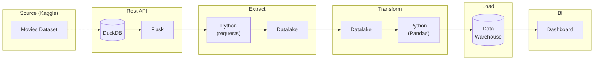

# End to End Movies ETL Data Engineering Pipeline

## Overview

This project demonstrates a data engineering pipeline. It was inspired by a technical take-home
assignment from a hiring process and later evolved into the final project for the
[Data Engineering Zoomcamp](https://github.com/DataTalksClub/data-engineering-zoomcamp) by
[DataTalks.Club](https://datatalks.club).

As a portfolio project, this repository focuses on demonstrating production-ready software and data
engineering practices - including clean architecture, reproducibility, automated testing, CI/CD,
infrastructure as code, observability, scalability, and maintainability - rather than processing
very large datasets.

### Dataset

For this project, I decided to use the `movies_metadata.csv` and `ratings.csv` files from the
[Movies Dataset from Rounak Banik](https://www.kaggle.com/datasets/rounakbanik/the-movies-dataset/)
available on Kaggle. Rather having the pipeline read the CSV files directly, I decided to expose the
data through a custom Flask REST API. This approach better simulates a real-world data engineering
scenario in which data is ingested from an external service.

### Goal

The goal of this pipeline is to ingest data from a REST API into a data lake, clean it and transform
it into analytics-ready datasets before loading it into a data warehouse, and ultimately use it to
power a BI dashboard.

### Architecture



## Getting Started

### Prerequisites

- Docker
- Docker Compose

### Run

```bash
cp .env.template .env
docker compose up --build
docker compose run prepare-data api postgres
docker compose run --rm etl
```


# WIP


### Original project

This project was first created as a technical challenge for a senior data engineer hiring process.
The challenge was as follow:

> You have access to a data source that exposes the following API:
>
> - POST - /auth
> - GET - /art/v3/genres
> - GET - /art/v3/genres/{genreId}/movies
> - GET - /art/v3/movies/{movieId}
> - GET - /art/v3/movies/{movieId}/ratings
>
> Inferring the information each endpoint contains:
>
> 1. Create a Postgres table that will contain the main information from these endpoints;
> 2. Write an ETL in Python that will populate this schema.

For this challenge I decide to implement a simple in-memory Python pipeline that would use:

- `Flask` reading from JSON files to simulate the API
- `requests` to download data from the API
- `Pandas` to manipulate the data and load the result into a `Postgres` database
- `docker compose` to coordinate the services

## Project Structure

```text
.
├── api/
├── etl/
├── docker-compose.yml
├── .env.template
└── README.md
```

## Technology Stack

- Python
- Flask
- PostgreSQL
- SQLAlchemy
- Docker Compose
- uv

## Pipeline Overview

1.  Authenticate with the API.
2.  Download movie data.
3.  Transform the data.
4.  Load it into PostgreSQL.


## Adding New Code

- Add new API endpoints in `api/`.
- Add extraction and transformation logic in `etl/`.
- Add new database tables and loaders as needed.
- Store configuration in `.env`.

## Next Steps

### Code Quality

- Unit tests
- Integration tests
- Better logging
- Improved error handling

### CI/CD

- Automated testing
- Docker image builds
- Deployment pipeline

### Orchestration

- Airflow DAG
- Scheduling
- Retries
- Monitoring

### Cloud

- S3 data lake
- dbt transformations
- Trino or BigQuery

### Performance

- Parallel API requests
- Batch inserts
- Incremental loading

## Acknowledgements

- Dataset source
- API inspiration
- Useful references

## Disclaimer

This project is intended for educational and portfolio purposes. Commercial use is not the intended
goal.
